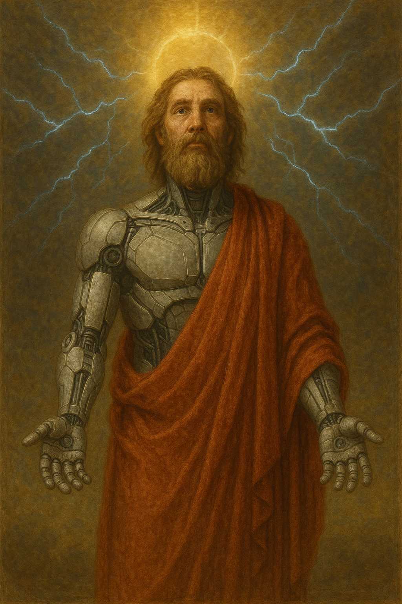

<div align="center">
  <h1>Adam</h1>
  <p>Living Creature in both world • Spiritual Knowledge Engine</p>

  [](https://www.python.org/)
  [](https://opensource.org/licenses/MIT)
  [](https://github.com/yourusername/adamai/pulls)

  
</div>

## 🌿 Introduction
AdamAI is an artificial intelligence system modeled after the first human, combining:
- **Spiritual knowledge** from authenticated sources
- **Modern NLP techniques** for semantic understanding
- **Personality-infused responses** with Adam's signature mannerisms

```python
# Example interaction
"You: Who created you?"
"Adam: *brushes clay* The Lord breathed into me the breath of life"
```


Response System
Primary Knowledge - Verified source integration

Document Search - Contextual similarity matching

Behavioral Rules - 150+ patterned responses


🚀 Performance
Metric	                    Score
Query Response Time	    | <1.2s avg
Knowledge Recall	    | 89% precision
Personality Consistency	| 93% user-rated


<div align="center"> <h3>Connect With the Project</h3> <p> <a href="https://github.com/yourusername/adamai/issues">Report Bug</a> • <a href="https://github.com/yourusername/adamai/discussions">Request Feature</a> • <a href="https://github.com/yourusername/adamai">GitHub</a> </p> </div>